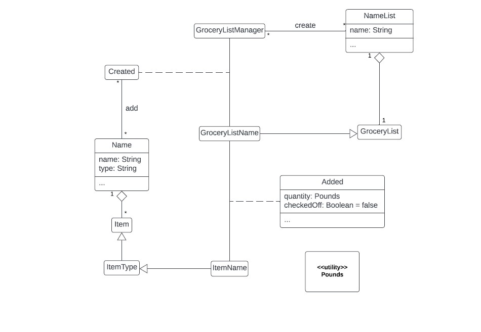
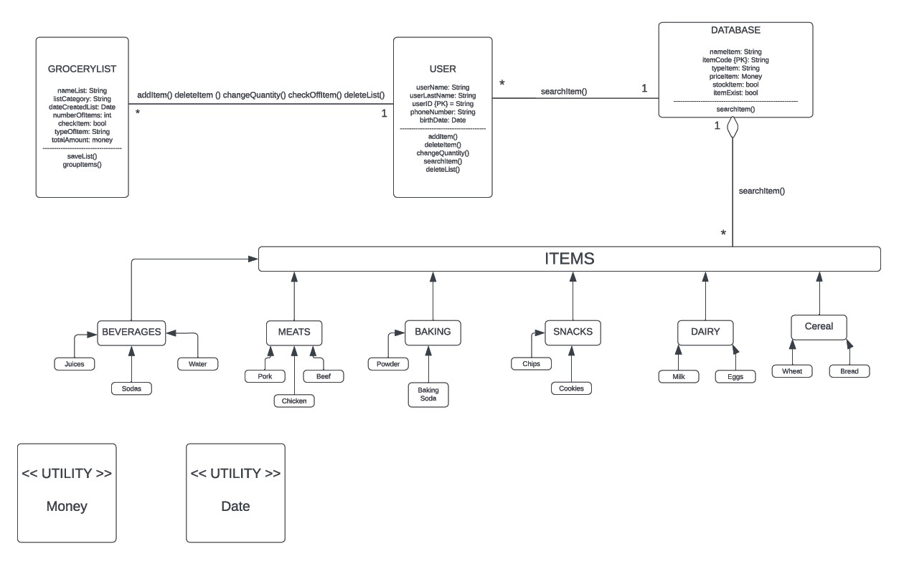
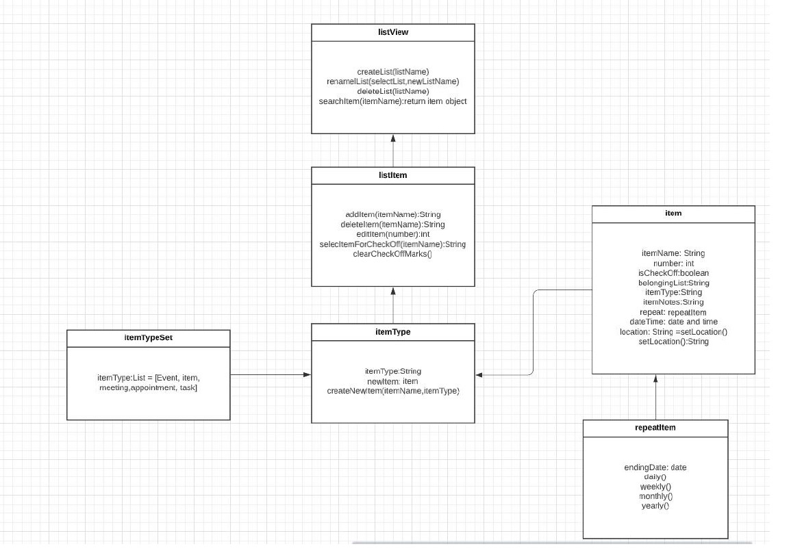
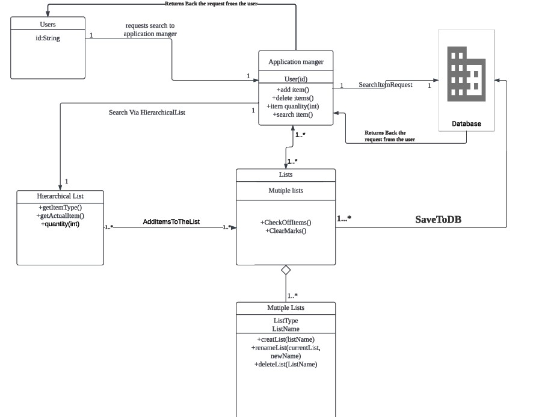
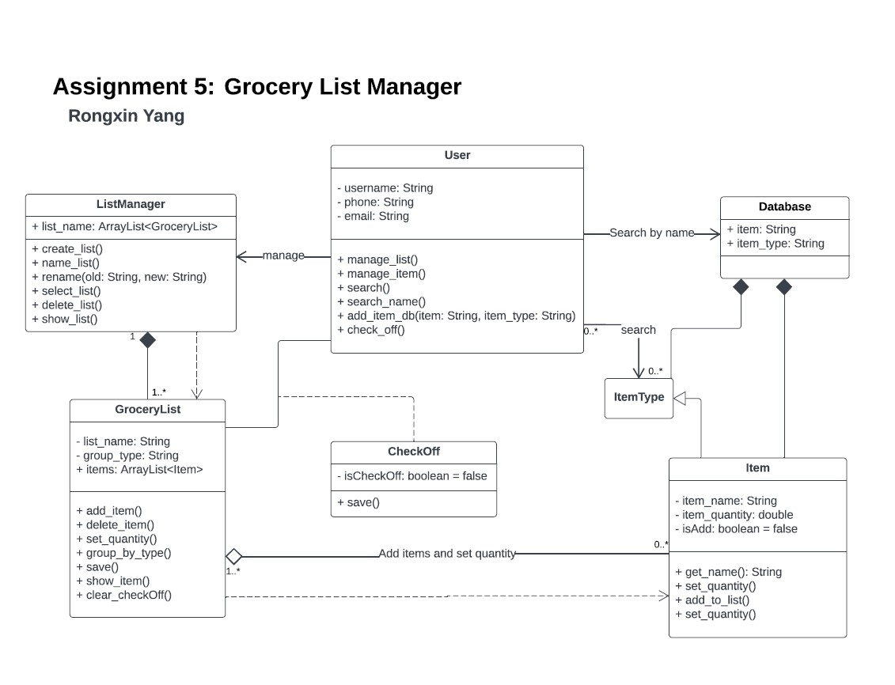
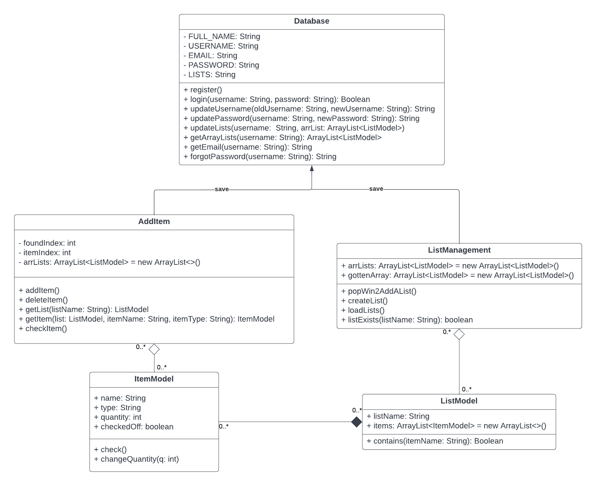

# Team 6

### Member:  Alyssa Ayala, Juan Bermeo, Zheng Huang, 

### 										Hongtao Jiang, Rongxin Yang
-------------------------------------

### Individual Designs:

#### Design 1 (Alyssa Ayala)

**PROS:**

- The hierarchy and inheritance of all of the classes are clear.
- The number of lists, items, and their types that can be created are clear.
- We can see what happens during the process of creating and adding lists and items.

**CONS:**

- Any additional actions like saving are not explicitly mentioned.

- Any commands that are to be used are not explicitly mentioned.

- DataBase is not mentioned.
  

#### Design 2 (Juan Bermeo)

**PROS:**

- Give lots of examples for item types and items.
- easier to implement in the future, since it has less classes.

**CONS:**

- The format of attributes and operations  of classes should be left-aligned and the first letter is lowercase.
- Do not have inheritance relationship for item type and actual item that show in diagram.

#### Design 3 (Zheng Huang)

**PROS:**

- Operations in each class are clear.
- The roles of each class are well specified, which will be useful in future implementations.

**CONS:**

- The format of attributes and operations  of classes should be left-aligned and the first letter is lowercase.
- Do not have inheritance relationship for item type and actual item that show in diagram.
- Needs a database for future implementions
- Any command to be used does not mention.

#### Design 4 (Hongtao Jiang)

 **PROS:** 

- The relationships between classes are clear.
- *The attributes and commands and are clearly to see.*

**CONS:**

- The format of attributes and operations of classes should be left-aligned and the first letter is lowercase. 
- Do not have inheritance relationship for item type and actual item that show in diagram.
- Too many arrows accoss the digram, some of them are unneccessary. And hard to implement each one of them.
- The relationships in different lists should maintain the same format.

#### Design 5 (Rongxin Yang)

**PROS:**

- The relationships are clear.
- Have inheritance relationship for item type and actual item.
- The roles of each class are well specified, which will be useful in future implementations.

**CONS:**

- The dashed arrows are not necessary if the classes are already connected through another relationship.
- The saving part is supposed to happen automatically when a list is modified, so a command for it may not be necessary.

-------------------

### Team Design

We decided to base our design mainly on Rongxin Yang's individual design. 
While some designs did not have user commands or a database mentioned, this design has both. We just needed to clean it up a little bit so that we can do all of the actions that a user is meant to with a design.
We also needed the relationships between different classes to be clear, such as which class inherits which and which arrows are not necessary, so we worked on those, too. 
In earlier versions, we kept the classes as they were. However, as the project progressed, the names of these classes and their structures changed. Therefore, this design has been
modified to match the final version of the app.

---------------------

### Summary

The most important lesson here is that everything needs to be clearly mentioned in a UML class design, or any design in general, to make its purpose the clearest they can be.
It is definitely more efficient to work as a team rather than by oneself as you may realize some things about the design that you didn't think about before.
These things may be crucial towards what may make a design flawed or better, in which improvements can always be made to a design.
In particular, commands and a clear database should be mentioned so that the users can get a clear of idea of what they can't and can't do, and ultimately, what the overall goal of the design is.

