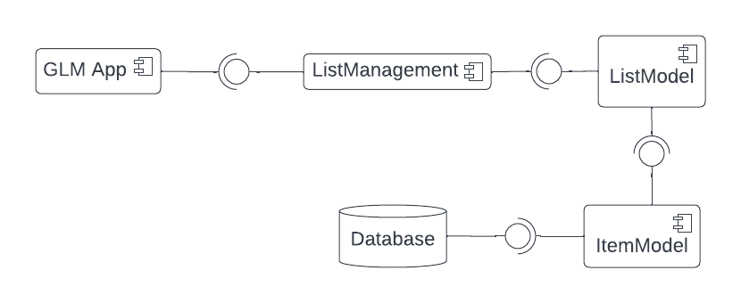
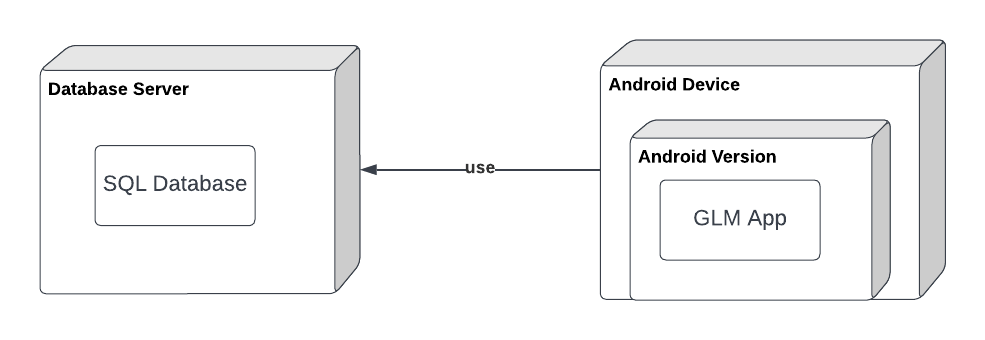
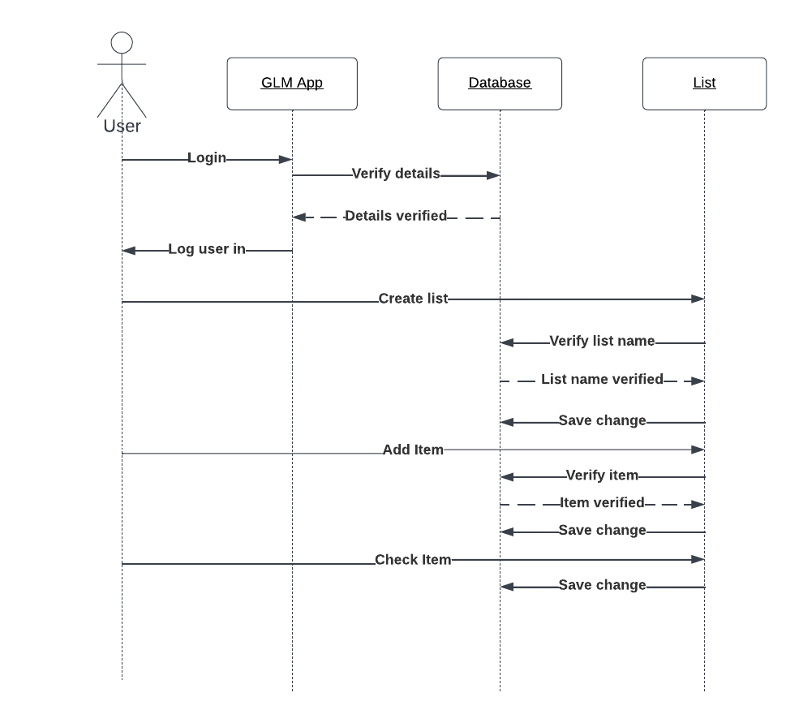
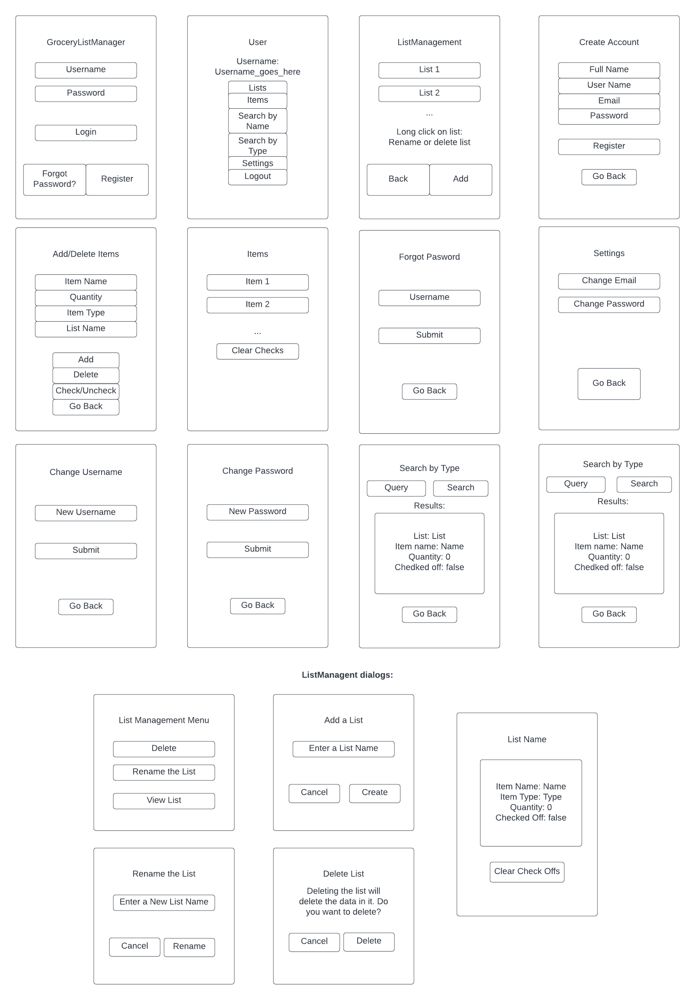

# Design Document

**Author**: Team 6 (Alyssa Ayala, Juan Bermeo, Zheng Huang, Hongtao Jiang, Rongxin Yang)

## 1 Design Considerations

### 1.1 Assumptions

The user should have an Android phone and downloads the *GroceryListManager* application.  

### 1.2 Constraints

The app does not support systems other than Android. Cannot share with other users.

### 1.3 System Environment

This app runs on Android devices with a minimum API level of 21.

## 2 Architectural Design

### 2.1 Component Diagram

GLM App component uses the services of ListManager component.

ListManagement component uses the services of List component.

ListModel component uses the services of Item component.

ItemModel component uses the services of database.

### 2.2 Deployment Diagram

The data is stored in Database Server by using SQL database. 

The Android device contains an Android version, which runs the GLM app.

## 3 Low-Level Design

### 3.1 Class Diagram

### 3.2 Other Diagrams (Sequence)

This is sequence diagram that shows some actions that users can do in our application.

## 4 User Interface Design

