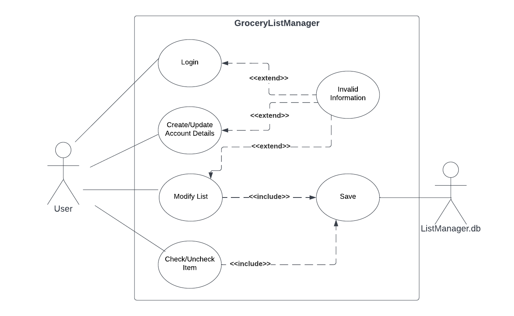

# Use Case Model

**Author**: Team 6 (Alyssa Ayala, Juan Bermeo, Zheng Huang, Hongtao Jiang, Rongxin Yang)

## 1 Use Case Diagram

## 2 Use Case Descriptions

### Login
- Requirements: When opening the app, the user must log into their account with a username and password.
- Pre-conditions: The given username and password must be correct.
- Post-conditions: The user will be logged into their account and taken to the "User" page..
- Scenarios: If the user gives the correct username and password, the user will be logged in. Otherwise, an error will come up. The user has the option to receive an email to get their password if they forgot it.

### Create/Update Account Details
- Requirements: The user must be able to register for an account in the app.
- Pre-conditions: The username must not be associated with an account yet.
- Post-conditions: The user now has an account in the app.
- Scenarios: If the username does not already exist, the account will be created. Otherwise, an error message will come up. A user can also choose to change their username or password while logged in.

### Modify List
- Requirements: The user must be able to modify their lists and the items/types in them.
- Pre-conditions: The requested change either does not exist already or does not interfere with any other lists.
- Post-conditions: The lists have been modified.
- Scenarios: The user may either change the list name or items/types. If a conflict occurs, then the change will not be applied while being given an error message. Here are some examples:
	- When creating something new, like a list or item, it must not already exist.
	- If you're modifying something like renaming a list or deleting an item/list, it must already exist.

### Check/Uncheck
- Requirements: The user must be able to check and uncheck items in their lists.
- Pre-conditions: The list and item in question must already exist together.
- Post-condition: The item in the given list must be in the opposite state that it was in (from unchecked to checked / from checked to unchecked).
- Scenarios: The user can check/uncheck an item individually, or they can clear all check offs at once while viewing the list. If the list or item don't exist, an error will occur as no checks/unchecks will happen.

### Invalid Information
- Requirements: The user must be informed if they entered information that conflicts with other information in their lists or account credentials.
- Pre-conditions: The user must have entered something that conflicts with their lists or account credentials.
- Post-condition: Nothing will happen to the database, and any conflicts will be avoided.
- Scenarios: These error messages may occur when either logged out or in. Here are some examples:
	- The username and password must be correct when attempting to login, or the user won't be able to log in.
	- The username must not already be associated with an account when attempting to create one, or no account will be created.
	- As explained for the Modify List case, a newly created list or item must not already exist yet, and those that are being updated must already exist. Either way, the modifications will not happen.

### Save
- Requirements: The database must automatically save the changes that the user makes to their lists.
- Pre-conditions: The user must have modified the lists or items in some way.
- Post-condition: The data now persists in the app as it is in the database and can be retrieved again.
- Scenarios: Any changes that modify the list must automatically be saved to the database. Checking or unchecking items in those lists must also be automatically saved.